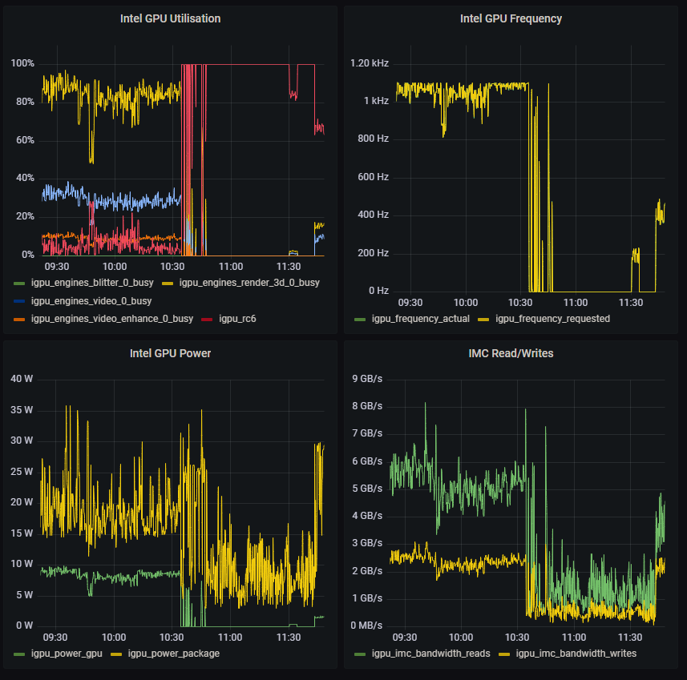

# Prometheus Intel GPU top exporter 

This is a [docker container](https://hub.docker.com/r/rhysbailey/prometheus-igpu-exporter) that runs a Prometheus exporter for `intel_gpu_top`.



## Run the exporter

Run the container as follows:

```bash
docker run -d -p 9100:9100 --privileged --name prometheus-igpu-exporter  rhysbailey/prometheus-igpu-exporter
```

If logs mention `Failed to initialize PMU! (Permission denied)`, `intel_gpu_top` doesn't have permissions to collect data. Check if running container as `--privileged`.

Refresh period of `intel_gpu_top` can be set with environment variable `--env REFRESH_PERIOD_MS=10000`